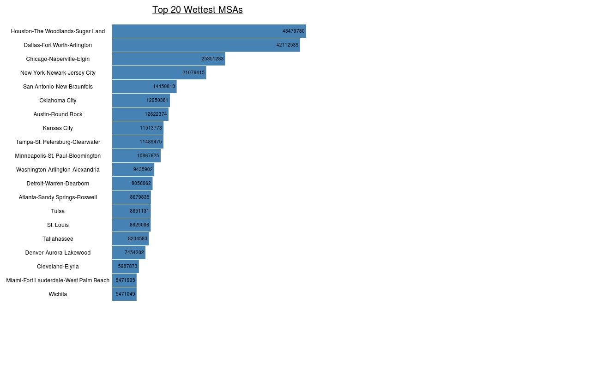
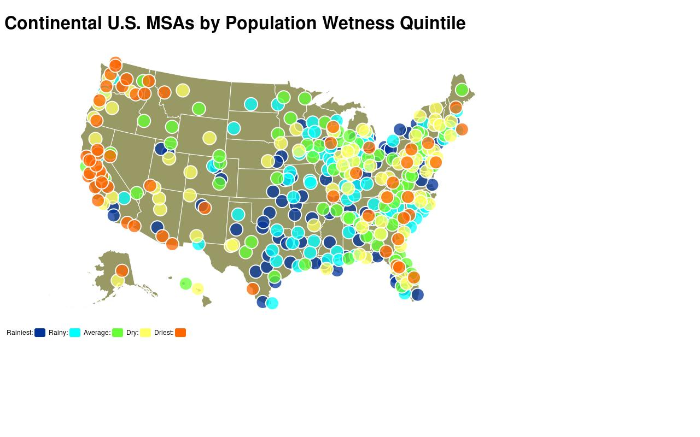

# rainsorter

## Synopsis

rainsorter ranks each Metropolitan Statistical Area(MSA) in the United States by a metric called "Population Wetness" calculated for the month of May, 2015. Population Wetness is defined as the total amount of daytime rain an MSA receives in the month multiplied by the number of people living in the MSA.

## Data Sets

Data from three government published data sets is used by rainsorter to calculate population wetness:

**1. Quality Controlled Local Climatological Data(QCLCD)**

Website: http://www.ncdc.noaa.gov/qclcd/QCLCD?prior=N  
Download: http://www.ncdc.noaa.gov/orders/qclcd/QCLCD201505.zip  
Date: May 2015  
Description: QCLCD contains two data sets of interest:
  1. Hourly precipitation data for each weather station
  2. List of weather stations

**2. Census Bureau Population Estimate**

Website: http://www.census.gov/popest/about/geo/terms.html  
Download: http://factfinder.census.gov/faces/tableservices/jsf/pages/productview.xhtml?pid=PEP_2015_PEPANNRES  
Date: July 2014  
Description: US Census population estimates broken down by MSA.

**3. TIGER/Line® Shapefiles** 

Website: https://www.census.gov/geo/maps-data/data/tiger-line.html  
Download: ftp://ftp2.census.gov/geo/tiger  
Date: August 2015  
Description: GIS data describing the geographical area covered by each MSA.

## Visualizations

http://strontian.github.io/rainsorter/top20.html  

Interactive Version:
http://strontian.github.io/rainsorter/usamap.html
  

## Definitions and Methodology

**Metropolitan Statistical Areas**

The United States is divided into geographic areas called Core Based Statistical Areas(CBSA). CBSAs can be either Metropolitan Statistical Areas(MSA) or Micropolitan Statistical Areas, of which this program concerns only the former. CBSAs(and therefore MSAs) are composed of counties and county equivalents.

See: https://en.wikipedia.org/wiki/Core-based_statistical_area

MSAs are designated by a GEOID code. This 5-digit code appears in the Shapefile data as an attribute named 'CBSAFP', and in the census data as a field named 'Id2.' It may also be referred to as a CBSA code.  

See: http://www.census.gov/geo/reference/gtc/gtc_cbsa.html

**Geographic Description of MSAs**

Geographical descriptions of MSAs are encoded in shapefiles. The shapefile contains both a geometric representation of the area covered by the MSA, as well as metadata from which we can extract the CBSA code and associate the geometry with the population estimate. We use the GeoTools(http://www.geotools.org) library to read shapefiles.

**Weather Stations**

Weather Stations are identified by a unique WBAN which is a 5-digit numerical code(may have leading 0s). The QCLCD weather station list also includes the longitude and latitude of each weather station. This location data can be used with the geographic description to associate a weather station with the MSA in which it is located.

**Precipitation Data**

Precipitation Data is broken down hourly and consists of: 

  1. WBAN to identify the station at which the reading was taken
  2. Inches of precipitation(trace amounts of precipitation <.005" are denoted as 'T')
  3. Hour recorded
  4. Optional flag denoting 'suspect' data

**Population Wetness Calculation**

Once all weather stations are associated with an MSA, the total amount of precipitation recorded by the station during the hours of 7am-12am is summed for the entire period. Suspect data is excluded. If multiple stations are located in an MSA, their precipitation is averaged. For cases when there are multiple stations in an MSA and one or more reports suspect data, those stations are excluded from the average for any hours during which suspect data was reported.

Once the total precipitation is calculated, it is multiplied by the population to find the Population Wetness.

## Output

Running the program creates a file [output/MSAs_By_Wetness.csv][output/MSAs_By_Wetness.csv]

## License

rainsorter is released under LGPL 2.1

## Dependencies

commons-csv (Apache 2.0) https://commons.apache.org/proper/commons-csv/  
Gson (Apache 2.0)  https://github.com/google/gson  
GeoTools (LGPL 2.1) http://www.geotools.org  

